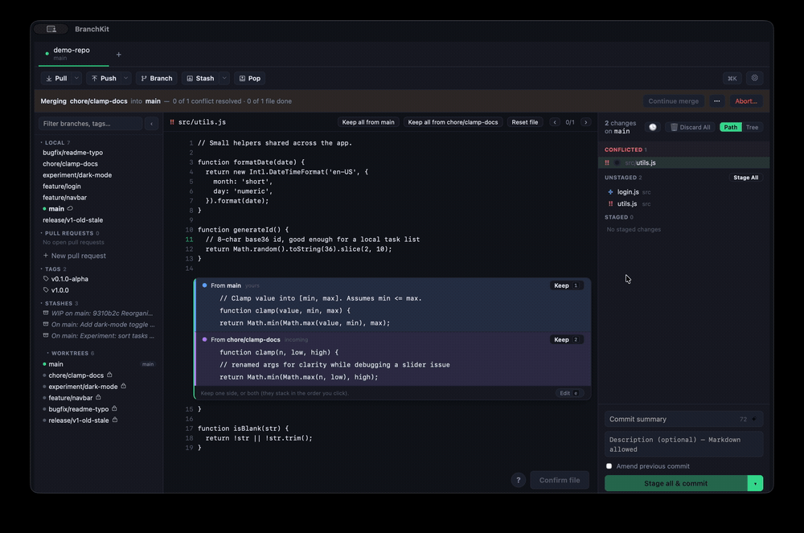
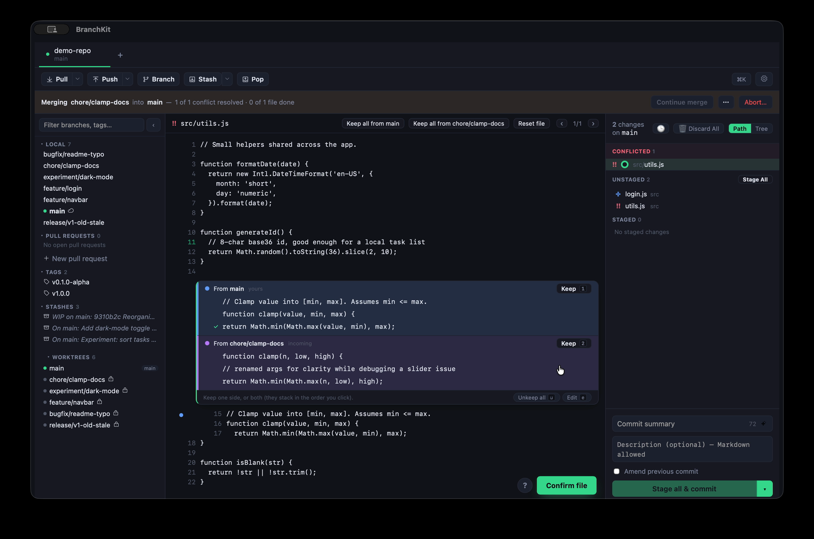
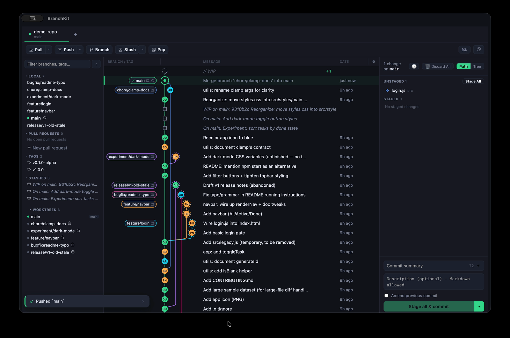

<div align="center">


# BranchKit

**A git client that makes the hard parts feel easy.**

Merge conflicts you resolve by pointing and clicking. A commit graph you
manipulate directly. Safety nets instead of scary dialogs.

Free · open source · cross-platform — with no accounts, telemetry, or upsells.

<br />


</div>

<br />

<div align="center">



<em>Resolving a merge conflict by choosing what to keep — no diff markers, no hand-editing.</em>

</div>

## Why BranchKit

Most git tools put git's complexity in front of you and expect you to manage it.
BranchKit hides it. The operations people usually dread — resolving conflicts,
rebasing, recovering from a mistake — become things you do by pointing, clicking,
and dragging, with the tool watching your back.

It's built for people who want git to get out of the way, not for people who enjoy
memorizing flags.

## Conflicts as choices, not marker soup

Conflict resolution is the part of git that scares people most, so it's the part
BranchKit works hardest to simplify. The **Keep Panel** replaces the usual wall of
`<<<<<<<` markers with a single, readable view of the file you're building.

<div align="center">



</div>

Each side of a conflict is a labelled block with its real branch name — *yours* and
*incoming*, not "ours" and "theirs" you have to decode. You **keep** a side with one
click, or keep both and they stack in the order you click them. Lines renumber live as
you go, you can keep individual lines, and there's a hand-edit escape hatch when you
need it — all fully keyboard-drivable. The same panel handles merge, rebase,
cherry-pick, revert, and stash conflicts, so there's one thing to learn instead of five.

## The graph is the workbench

The commit graph isn't just a picture of history — it's how you *do* things. Drag one
branch onto another to merge, rebase, or fast-forward. Double-click a remote branch to
create a tracking branch and check it out in a single gesture. Stashes live right in the
graph, unpushed commits wear a dashed halo so you can see what's local at a glance, and
the top row doubles as your commit message editor.

<div align="center">



</div>

## Nothing you do is scary

BranchKit assumes you'll make mistakes and makes them cheap to undo. Every discard is
recoverable for 7 days. Force-pushes use `--force-with-lease` only. Amending a pushed
commit warns you first. When something does go wrong, errors are written in plain
language with a suggested fix — not raw git output you have to interpret.

## Everything else, kept simple

- **Staging that stays out of your way.** Stage by file, hunk, or single line; `Space`
  walks the list; discards stay recoverable.
- **AI commit messages, local-first and optional.** Use the in-app managed local model
  (llama.cpp), your own Ollama, or any OpenAI-/Anthropic-format endpoint. Keys live in
  the OS keychain, never in a config file.
- **GitHub, only if you want it.** Device-flow sign-in, a PR panel, create/merge/checkout
  PRs, and CI status dots — entirely optional.
- **The rest.** Multi-repo tabs, worktrees, file history and blame, a `⌘K` command
  palette, and dark + light themes.

## Install

Download the latest release for your OS from [Releases](../../releases): `.dmg` (macOS),
`.msi` (Windows), `.AppImage` / `.deb` (Linux). Requires git ≥ 2.30 on your PATH. On
Linux, secure credential storage uses libsecret/gnome-keyring; without it, secrets are
kept in memory for the session only.

## Building from source

Requires [Rust](https://www.rust-lang.org/tools/install), [Node.js](https://nodejs.org/) 18+,
and the [Tauri prerequisites](https://v2.tauri.app/start/prerequisites/) for your OS.

```sh
npm install
npm run tauri dev    # run in development
npm run tauri build  # produce a release bundle
```

Tests and lints: `cargo test` and `cargo clippy -- -D warnings` in `src-tauri`,
`npx vitest run` and `npm run check` at the root.

On macOS, `tauri dev` runs an unsigned debug binary, which gets a new identity on every
rebuild — so if you've connected GitHub or a remote AI provider (both store a secret in the
Keychain), macOS will re-prompt for Keychain access on every launch even after "Always Allow."
Run `bash scripts/dev-cert-setup.sh` once to create a stable local signing identity, then use
`npm run tauri:dev:signed` instead of `npm run tauri dev` — it signs the debug binary with that
identity before launching, so the Keychain grant sticks across rebuilds.

## Contributing

Issues and pull requests are welcome. Before opening a PR: read `docs/DESIGN_SPEC.md` and
`docs/ARCHITECTURE.md` (they are the source of truth for UX and technical decisions), keep
all colors on design tokens, route all IPC through `src/lib/ipc.ts`, and make sure the test
and lint commands above pass on your change.

## License

[AGPL-3.0](LICENSE). BranchKit is an independent project, not affiliated with, endorsed by,
or connected to GitKraken or Axosoft, LLC.
